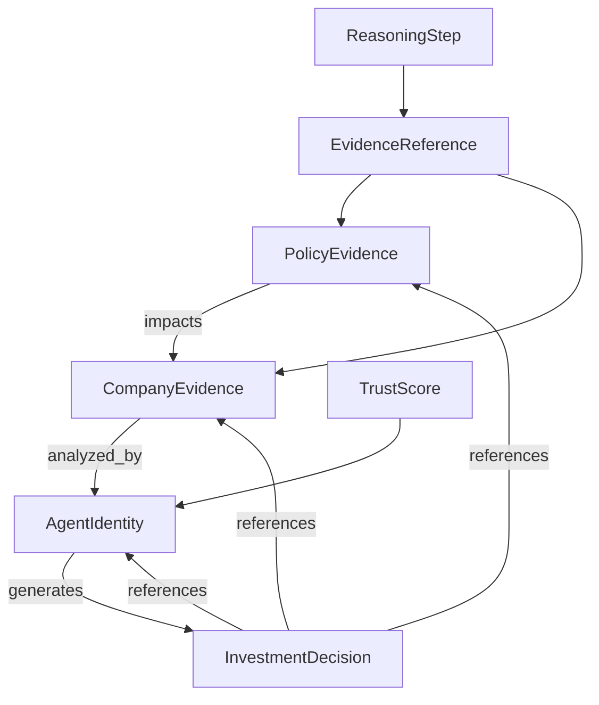

# 🔍 OpenInvest Trust Object Model

## Overview

This document defines the core trust objects for the future OpenInvest ecosystem. These objects form the foundation for establishing trust between DeepTech agents in the AI economy.

**Important**: These represent planned trust objects. No implementation exists yet. This remains conceptual design for future trust infrastructure.

---

## Current Status

**NOT IMPLEMENTED**

All trust objects defined in this document are conceptual designs for future implementation.

---

## Future Trust Objects

### 1. Policy Evidence Object

The PolicyEvidence object represents verifiable government policy information with complete provenance tracking.

```typescript
interface PolicyEvidence {
  // Core Identification
  id: string;                              // Unique UUID identifier
  title: string;                           // Human-readable policy title
  jurisdiction: string;                    // Geographic/country jurisdiction
  policy_type: "REGULATORY" | "INCENTIVE" | "GUIDANCE" | "MANDATE";
  
  // Source Information
  source: string;                          // Original source URL/identifier
  source_type: "GOVERNMENT" | "THIRD_PARTY" | "AGGREGATOR";
  publisher: string;                       // Publishing entity
  publication_date: Date;                  // Official publication date
  
  // Evidence & Provenance
  evidence_hash: string;                  // Cryptographic hash of evidence
  verification_status: "PENDING" | "VERIFIED" | "REJECTED" | "OUTDATED";
  confidence_score: number;                // 0.0 to 1.0 confidence rating
  last_verified: Date;                    // Last verification timestamp
  
  // Metadata
  tags: string[];                         // Technology domain tags
  relevance_score: number;                 // 0.0 to 1.0 relevance to query
  freshness_score: number;                // 0.0 to 1.0 recency rating
  
  // Relationships
  related_policies: string[];             // IDs of related policies
  supporting_documents: string[];         // IDs of supporting evidence
  impacted_companies: string[];            // IDs of affected companies
}
```

**Status**: Planned Trust Object

---

### 2. Company Intelligence Object

The CompanyEvidenceObject represents verifiable company information with technology focus and investment context.

```typescript
interface CompanyEvidence {
  // Core Identification
  id: string;                              // Unique UUID identifier
  legal_name: string;                     // Official legal company name
  dba_name: string;                       // "Doing Business As" name
  registration_number: string;             // Official registration ID
  
  // Technology Profile
  technology_tags: string[];               // Core technology domains
  technology_stage: "RESEARCH" | "DEVELOPMENT" | "PROTOTYPE" | "PRODUCT" | "SCALE";
  technical_maturity: number;             // 1-10 scale of technical readiness
  
  // Business Information
  industry_sector: string;                 // Primary industry classification
  business_model: "B2B" | "B2C" | "B2G" | "HYBRID";
  revenue_stage: "PRE_REVENUE" | "EARLY_REVENUE" | "GROWTH" | "MATURE";
  
  // Investment Context
  funding_stage: "SEED" | "SERIES_A" | "SERIES_B" | "LATER" | "PUBLIC";
  total_funding: number;                  // Total funding in USD
  last_funding_date: Date;                // Most recent funding date
  valuation_range: string;                // Valuation range (e.g., "$10M-$50M")
  
  // Source & Provenance
  primary_source: string;                 // Primary information source
  source_reliability: number;             // 0.0 to 1.0 source reliability
  data_freshness: Date;                   // Last data update timestamp
  verification_status: "PENDING" | "VERIFIED" | "OUTDATED";
  
  // Relationships
  related_policies: string[];             // Policy IDs affecting this company
  technology_partners: string[];          // Partner company IDs
  competitive_landscape: string[];       // Related competitor IDs
  
  // Metadata
  risk_assessment: number;                // 1-10 risk rating
  growth_potential: number;              // 1-10 growth potential
  market_position: string;               // Market positioning description
}
```

**Status**: Planned Trust Object

---

### 3. Agent Identity Object

The AgentIdentity object represents verified agent identity with capability declarations and trust scoring.

```typescript
interface AgentIdentity {
  // Core Identity
  agent_id: string;                       // Unique UUID identifier
  agent_name: string;                     // Human-readable agent name
  agent_type: "INVESTMENT" | "POLICY" | "COMPANY" | "ANALYST" | "INFRASTRUCTURE";
  jurisdiction: string;                   // Operating jurisdiction
  
  // Verification & Trust
  identity_verified: boolean;             // Identity verification status
  verification_provider: string;          // Third-party verification service
  verification_certificate: string;       // Digital certificate ID
  trust_score: number;                    // 0.0 to 1.0 overall trust score
  reputation_history: ReputationEntry[];  // Historical performance record
  
  // Capability Declaration
  capabilities: CapabilityDeclaration[];   // What the agent can do
  specializations: string[];               // Areas of expertise
  api_endpoints: string[];                // Available service endpoints
  
  // Communication
  supported_protocols: string[];          // Supported communication protocols
  encryption_requirements: string[];       // Security requirements
  data_access_permissions: string[];      // Information access scope
  
  // Performance Metrics
  response_accuracy: number;               // Historical accuracy (0.0-1.0)
  consistency_score: number;              // Response consistency (0.0-1.0)
  timeliness_score: number;               // Response timeliness (0.0-1.0)
  error_rate: number;                     // Historical error rate
  
  // Relationships
  trusted_agents: string[];               // IDs of trusted peer agents
  service_consumers: string[];             // IDs of consuming agents
  service_providers: string[];            // IDs of provider agents
  
  // Metadata
  created_at: Date;                       // Agent creation timestamp
  last_active: Date;                      // Last activity timestamp
  version: string;                        // Agent version identifier
}
```

**Status**: Planned Trust Object

---

### 4. Investment Decision Object

The InvestmentDecisionObject represents structured investment recommendations with full evidence trails and reasoning transparency.

```typescript
interface InvestmentDecision {
  // Decision Context
  decision_id: string;                    // Unique UUID identifier
  decision_type: "INVEST" | "PASS" | "WATCH" | "DIVEST";
  decision_made: Date;                   // Decision timestamp
  
  // Recommendation Details
  target_company: string;                 // Target company ID
  recommendation_strength: number;         // 1-10 strength of recommendation
  confidence_level: number;               // 0.0 to 1.0 decision confidence
  time_horizon: string;                   // Investment time horizon
  
  // Decision Components
  decision: string;                       // Final decision outcome
  evidence: EvidenceReference[];         // Supporting evidence references
  reasoning_trace: ReasoningStep[];      // Step-by-step reasoning process
  alternative_analysis: string;          // Considered alternatives
  
  // Risk Assessment
  risk_factors: RiskFactor[];            // Identified risk elements
  mitigation_strategies: string[];       // Risk mitigation approaches
  downside_protection: number;           // Downside protection rating
  
  // Financial Context
  investment_amount: number;              // Suggested investment amount
  valuation_assessment: number;           // Valuation assessment
  expected_return: number;               // Expected return percentage
  risk_adjusted_return: number;          // Risk-adjusted return metric
  
  // Source Attribution
  decision_maker: string;                 // Agent/analyst making decision
  verification_status: "PENDING" | "REVIEWED" | "APPROVED";
  approval_chain: ApprovalStep[];        // Decision approval process
  
  // Temporal Context
  decision_expiry: Date;                  // Decision validity period
  review_schedule: Date;                 // Next scheduled review
  update_history: DecisionUpdate[];      // Historical decision updates
  
  // Metadata
  decision_framework: string;           // Decision methodology used
  compliance_status: string;             // Regulatory compliance status
  audit_trail: AuditEntry[];             // Complete decision audit trail
}
```

**Status**: Planned Trust Object

---

## Trust Object Relationships



## Implementation Roadmap

### Phase 1: Foundation (Current)
- Define trust object schemas
- Establish verification frameworks
- Create metadata standards

### Phase 2: Implementation (Future)
- Build object storage systems
- Implement verification workflows
- Develop relationship tracking

### Phase 3: Integration (Future)
- Connect with MCP/A2A protocols
- Enable cross-agent trust exchange
- Establish reputation networks

---

*Trust Object Model Design: August 25, 2026*  
*Status: Architecture Design Phase - No Implementation Yet*  
*Vision: "The USB-C for DeepTech"*  
*Current Status: Experimental Trust Infrastructure Prototype*